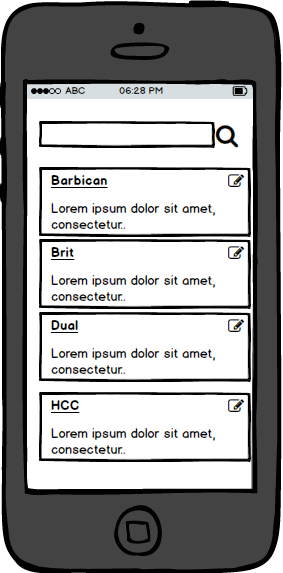

# 01 Client List Layout

# Paso a paso

- Partimos del ejemplo anterior, como siempre, copiamos el contenido y hacemos un:

_npm install_

- Vamos ahora a crear el layout de la lista de cliente, estamos buscando tener un aspecto tal que así:



- En este caso vamos a crear una jerarquía de componentes, es decir:
  - Tendremos el componente lista.
  - El componente _card_ para mostrar la información de cada cliente.
  - Un componente _search_ para tener una cabecera de busqueda.

Esto quedaría de la siguiente manera:

```
\---client-list
        |   client-list.component.html
        |   client-list.component.ts
    \---result
        |   client-result.component.ts
        |   client-result.html
        |
   \---card
        |   client.list.card.component.html
        |   client.list.card.component.ts
        |   client.list.result.component.html
        |   client.list.result.component.ts
   \---search
            client.list.search.component.ts
            client.list.search.component.html
```

> Dependiendo de la versión de Angular con la que estés trabajando puede que crear componentes sea posible o puede que no y tengas que declararlo todo en el mismo o crear directivas como componentes (si estás en la versión 1.2 es muy probable), aquí siempre consulta con tu responsable de proyecto y estudia la base de código ya existente para ser consistente con la solución.

Vamos a construir el componente _search_:

_./src/app/pages/client-list/search/client-list-search.component.html_

```html
<div class="input-group">
  <input type="text" class="form-control" placeholder="Search" />

  <span class="input-group-btn">
    <button class="btn btn-primary" type="button">
      <i class="glyphicon glyphicon-search"></i>
    </button>
  </span>
</div>
```

_./src/app/pages/client-list/search/client-list-search.component.ts_

```ts
export const ClientListSearchComponent = {
  template: require("./client-list-search.component.html") as string,
};
```

Vamos a registrar este componente a nivel de aplicación (en un proyecto más grander podriamos tener un módulo por cada página).

_./src/app/app.ts_

```diff
import * as angular from "angular";
import { AppComponent } from "./app.component";
import { routing } from "./app.routing";
import { LoginComponent } from "./pages/login/login.component";
import { ClientListComponent } from "./pages/client-list/client-list.component";
+ import { ClientListSearchComponent } from "./pages/client-list/search/client-list-search.component";

angular
  .module("app", ["ui.router"])
  .config(routing)
  .component("app", AppComponent)
  .component("login", LoginComponent)
  .component("clientlist", ClientListComponent)
+ .component("clientlistsearch", ClientListSearchComponent);
```

Vamos a usarlo en nuestra página de clientes:

_./src/app/pages/client-list/client-list.component.html_

```diff
<div>
-  <h1>Hello From Client Component !</h1>
+  <clientlistsearch></clientlistsearch>
</div>
```

- Probamos que se ve todo ok:

```bash
npm start
```

- Bien ya tenemos la cabecera de busqueda, vamos ahora a crear la págin a de resultados, para ello vamos a hardcodear valores (todavía no nos metemos a consumir servicios):

> En este caso en vez de usar bootstrap, vamos a usar un contenedor flexbox, de esta manera puedes ver que si el desarrollo va a correr en navegadores modernos (IE NO, Chrome, Firefox, Safari, ...), y los responsables del proyecto están de acuerdo puedes usarlo (en este caso por simplicidad metemos los estilos como _style_ lo normal sería añadirlos como CSS)

_./src/app/pages/client-list/result/client-list-result.component.html_

```html
<div style="display:flex;flex-direction:column">
  <div class="panel panel-default" style="height: 80px">
    <a href="/#">My sport dealer</a>
    <span>Lorem ipsum dolor sit amet, consectetur.. </span>
  </div>
  <div class="panel panel-default" style="height: 80px">
    <a href="/#">We Run</a>
    <span>Lorem ipsum dolor sit amet, consectetur.. </span>
  </div>
</div>
```

_./src/app/pages/client-list/result/client-list-result.component.ts_

```ts
export const ClientListResultComponent = {
  template: require("./client-list-result.component.html") as string,
};
```

¿Qué estamos haciendo aquí?

- Creamos un contenedor flexbox, y con flex-direction:column le decimos que queremos que los elementos se muestren en una columna (es decir que se vayan apilando uno debajo de otro).

- Creamos un div por cada card y simulamos que hay un listado (después sustituiremos esto por un componente card, y más adelante utilizaremos un _ngRepeat_ para mostrar el listado de clientes, a esto o llamamos desarrollo progresivo).

- Si te fijas para estilar el card estamos usando clases de _bootstrap_.

Vamos a registrarlo:

_./src/app/app.ts_

```diff
import * as angular from "angular";
import { AppComponent } from "./app.component";
import { routing } from "./app.routing";
import { LoginComponent } from "./pages/login/login.component";
import { ClientListComponent } from "./pages/client-list/client-list.component";
import { ClientListSearchComponent } from "./pages/client-list/search/client-list-search.component";
+ import { ClientListResultComponent } from "./pages/client-list/result/client-list-result.component";

angular
  .module("app", ["ui.router"])
  .config(routing)
  .component("app", AppComponent)
  .component("login", LoginComponent)
  .component("clientlist", ClientListComponent)
  .component("clientlistsearch", ClientListSearchComponent)
+ .component("clientlistresult", ClientListResultComponent);
```

Y vamos a usarlo en nuestra página de clientes:

_./src/app/pages/client-list/client-list.component.html_

```diff
<div>
   <clientlistsearch></clientlistsearch>
+  <clientlistresult></clientlistresult>
</div>
```

- Vamos a comprobar que todo esto funciona:

```bash
npm start
```

- Bueno ya tenemos los dos cards (si te gusta el css... con un par de ajustes podrías hacer que tuviera mejor aspecto ;)), nos vamos a centrar ahora en Angular y componentizar.


